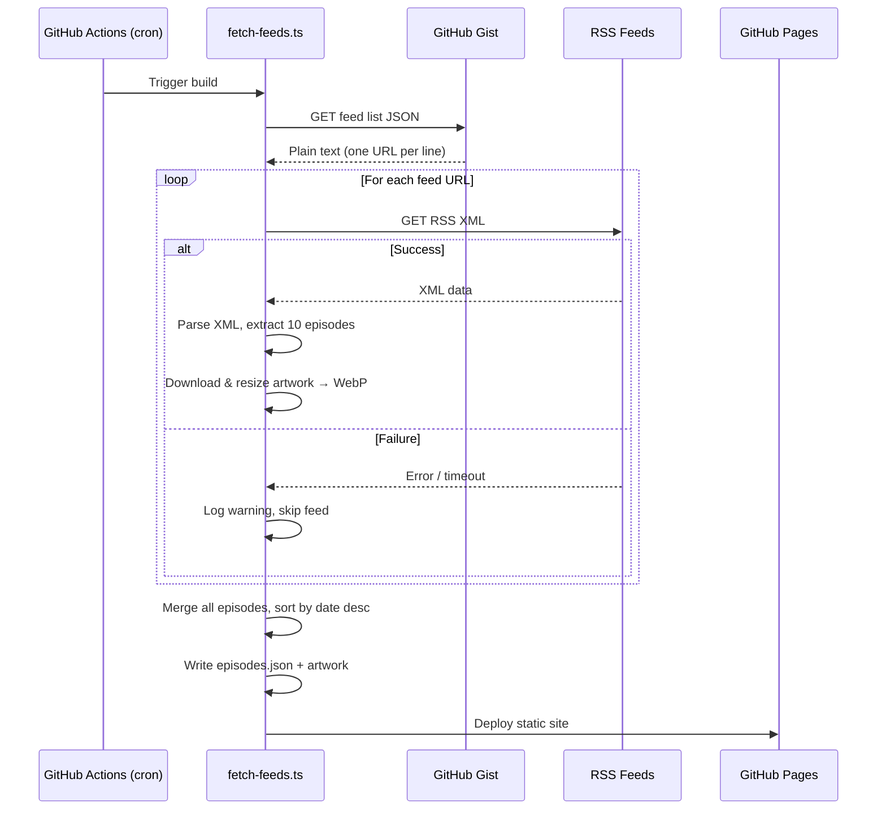
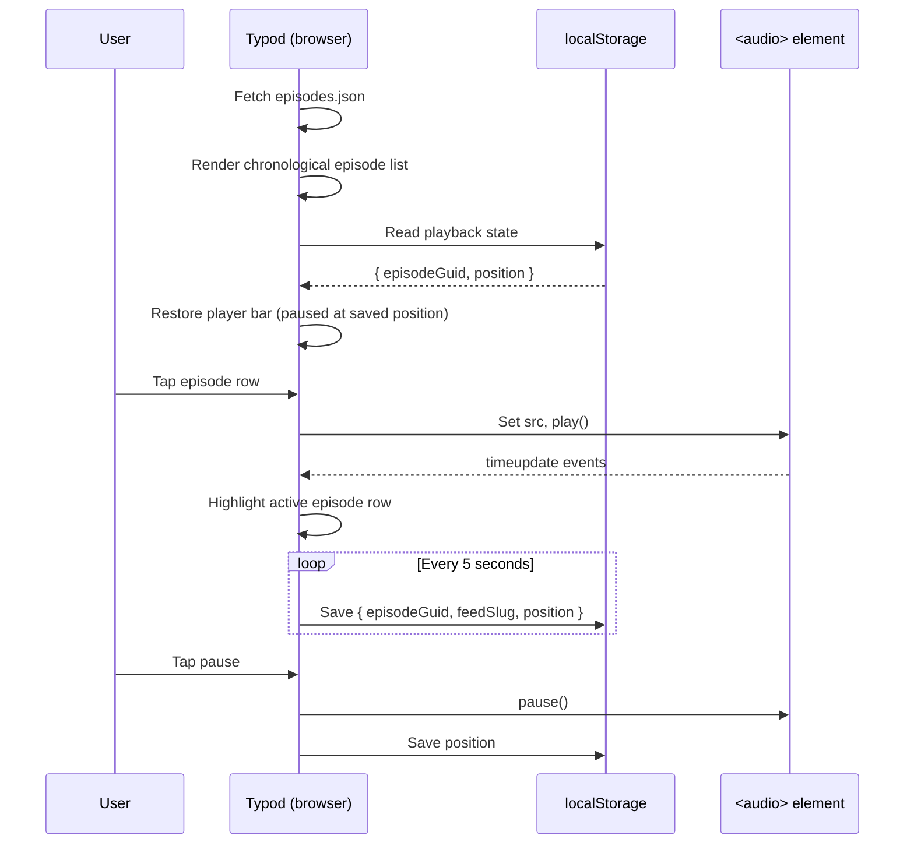

# Typod - Technical & Visual Design

## Overview

Typod is a statically-built, client-rendered podcast player. A GitHub Action fetches RSS feeds at build time, merges all episodes into a single chronological JSON file, and outputs optimized artwork. The frontend is a single-page TypeScript app — no routing, just one scrollable list of episodes with a persistent audio player. The primary target device is a phone. No server runtime is required.

---

## Architecture

```
┌─────────────────────────────────────────────────────────────┐
│  GitHub Gist (feed list)                                    │
│  https://feed1.xml  (one URL per line, plain text)           │
└──────────────────────┬──────────────────────────────────────┘
                       │ fetched at build time
                       ▼
┌─────────────────────────────────────────────────────────────┐
│  GitHub Actions (daily cron)                                │
│                                                             │
│  1. Fetch Gist → parse feed URLs                            │
│  2. For each feed: fetch RSS → parse XML → extract 10 eps   │
│  3. Merge all episodes → sort by pubDate descending         │
│  4. Resize artwork → output WebP thumbnails (48px, 96px)    │
│  5. Write episodes.json to dist/data/                       │
│  6. Build static site → deploy to GitHub Pages              │
└──────────────────────┬──────────────────────────────────────┘
                       │
                       ▼
┌─────────────────────────────────────────────────────────────┐
│  GitHub Pages (static hosting)                              │
│                                                             │
│  /index.html                                                │
│  /assets/app.[hash].js                                      │
│  /assets/app.[hash].css                                     │
│  /data/episodes.json       ← all episodes, sorted by date   │
│  /data/artwork/[slug]-48.webp                               │
│  /data/artwork/[slug]-96.webp                               │
└──────────────────────┬──────────────────────────────────────┘
                       │
                       ▼
┌─────────────────────────────────────────────────────────────┐
│  Browser (client-side app)                                  │
│                                                             │
│  Fetch episodes.json → render chronological episode list    │
│  Audio playback via <audio> element                         │
│  State persisted to localStorage                            │
└─────────────────────────────────────────────────────────────┘
```

---

## Build Pipeline (GitHub Actions)

### Trigger

```yaml
on:
  schedule:
    - cron: '0 22 * * *'  # Daily at 5:00 PM ET (22:00 UTC; 6 PM during EDT)
  workflow_dispatch:        # Manual trigger
  push:
    branches: [main]
```

### Feed Fetch Script (`scripts/fetch-feeds.ts`)

A Node.js/TypeScript script that:

1. **Reads the Gist**: Fetches `FEED_GIST_URL` (repository secret/variable). Parses as plain text — one URL per line, blank lines and `#` comments ignored.
2. **Fetches each RSS feed**: Uses `fetch()` with a 15-second timeout per feed. On failure, logs a warning and skips.
3. **Parses XML**: Uses a lightweight XML parser (e.g., `fast-xml-parser`) to extract:
   - Feed: `title`, `imageUrl`
   - Per episode (latest 10): `title`, `guid`, `pubDate`, `duration`, `enclosureUrl`, `description`
4. **Processes artwork**: Downloads each feed's artwork image and resizes to 48px and 96px WebP using `sharp` (small thumbnails for inline display in the episode list). On failure, skips artwork (frontend falls back to placeholder).
5. **Merges and sorts**: Combines all episodes from all feeds into a single array, sorted by `pubDate` descending. Episodes with the same date are sorted alphabetically by show title.
6. **Writes output**:
   - `dist/data/episodes.json` — the merged, sorted array of all episodes (each episode includes its parent feed's title and artwork slug)
   - `dist/data/artwork/[slug]-48.webp` and `[slug]-96.webp`

### Slug Generation

Feed slugs are derived from the feed title: lowercased, non-alphanumeric characters replaced with hyphens, deduplicated.

### Error Handling

- Individual feed failures: logged, skipped, build continues.
- Gist fetch failure: build fails (fatal — no feed list means nothing to build).
- Artwork processing failure: logged, skipped (placeholder used in UI).

---

## Data Models (TypeScript)

```typescript
// Single episode with parent feed info (episodes.json)
interface Episode {
  guid: string;
  title: string;
  feedTitle: string;
  feedSlug: string;
  artworkSrc: string | null;   // path to 96px WebP (2x for 48px display)
  pubDate: string;             // ISO 8601
  duration: number | null;     // seconds, null if not provided
  enclosureUrl: string;
  description: string;         // HTML allowed, sanitized at render
}

// localStorage state
interface PlaybackState {
  episodeGuid: string;
  feedSlug: string;
  position: number;            // seconds
  updatedAt: string;           // ISO 8601
}
```

Note: `FeedMeta` is no longer needed as a separate type — feed info is denormalized onto each episode since there's no feed-level view.

---

## Frontend Application

### Technology

- **Language**: TypeScript (strict mode)
- **Bundler**: Vite (fast builds, good GitHub Pages support)
- **Framework**: Vanilla TypeScript with DOM APIs (no framework — keeps bundle tiny for a simple app)
- **Styling**: Vanilla CSS with custom properties for theming

### Application Structure

```
src/
├── main.ts              # Entry point, data fetch, render
├── state.ts             # localStorage read/write, playback state
├── player.ts            # Audio element wrapper, playback controls
├── components/
│   ├── player-bar.ts    # Persistent bottom player bar
│   └── episode-row.ts   # Single episode row in the list
├── types.ts             # Shared TypeScript interfaces
├── utils.ts             # Formatting helpers (duration, dates)
└── style.css            # All styles
```

### Routing

None. The app is a single page — one scrollable list of episodes with a fixed player bar at the bottom. No hash routing, no navigation.

### State Management

No framework state — a simple module (`state.ts`) that:
- Reads/writes `PlaybackState` to `localStorage` key `typod_playback`
- Exposes `getPlaybackState()` and `savePlaybackState()` functions
- Wraps in try/catch for localStorage unavailability

### Audio Playback

A singleton `<audio>` element managed by `player.ts`:
- `play(episode)` — sets src, plays
- `pause()` / `resume()`
- `seek(seconds)`
- Emits custom events for UI updates (timeupdate, ended, etc.)
- Saves position to localStorage every 5 seconds during playback

---

## Visual Design

### Aesthetic Direction: "Warm Editorial"

The design takes cues from modern editorial/magazine layouts — clean reading typography, generous whitespace, and subtle warmth. It avoids the cold utility of typical developer-built tools while staying restrained enough to feel fast and functional. Designed for one-handed phone use.

### Typography

**Font**: [Source Serif 4](https://fonts.google.com/specimen/Source+Serif+4) for the app title/header, system sans-serif stack for everything else.

- Source Serif 4 is a variable font (single file, small payload ~40KB woff2 for the weight range we need).
- App title uses 700 weight for warmth and presence.
- All other text uses the system stack: `-apple-system, BlinkMacSystemFont, "Segoe UI", "Helvetica Neue", sans-serif` — zero download cost, native feel on every phone.

```css
@import url('https://fonts.googleapis.com/css2?family=Source+Serif+4:wght@700&display=swap');
```

Loading strategy: `font-display: swap`. Only the title needs the web font; everything else is instant.

### Color Palette

#### Light Mode

| Role           | Value     | Usage                              |
|----------------|-----------|------------------------------------|
| Background     | `#FAF8F5` | Page background (warm off-white)   |
| Surface        | `#FFFFFF` | Player bar                         |
| Text Primary   | `#1A1A1A` | Episode titles, body text          |
| Text Secondary | `#6B6560` | Show name, dates, durations        |
| Accent         | `#C4551A` | Play button, active episode        |
| Accent Hover   | `#A3440F` | Pressed state on accent elements   |
| Border         | `#E8E4DF` | Episode row dividers               |
| Placeholder BG | `#ECE8E3` | Artwork loading placeholder        |

#### Dark Mode

| Role           | Value     | Usage                              |
|----------------|-----------|------------------------------------|
| Background     | `#1A1917` | Page background (warm near-black)  |
| Surface        | `#252422` | Player bar                         |
| Text Primary   | `#EDEBE8` | Episode titles, body text          |
| Text Secondary | `#9B9590` | Show name, dates, durations        |
| Accent         | `#E07A3E` | Play button, active episode        |
| Accent Hover   | `#F09050` | Pressed state on accent elements   |
| Border         | `#3A3835` | Episode row dividers               |
| Placeholder BG | `#2E2C29` | Artwork loading placeholder        |

#### CSS Custom Properties

```css
:root {
  --color-bg: #FAF8F5;
  --color-surface: #FFFFFF;
  --color-text: #1A1A1A;
  --color-text-secondary: #6B6560;
  --color-accent: #C4551A;
  --color-accent-hover: #A3440F;
  --color-border: #E8E4DF;
  --color-placeholder: #ECE8E3;

  --font-heading: 'Source Serif 4', Georgia, 'Times New Roman', serif;
  --font-body: -apple-system, BlinkMacSystemFont, 'Segoe UI', 'Helvetica Neue', sans-serif;

  --space-xs: 4px;
  --space-sm: 8px;
  --space-md: 16px;
  --space-lg: 24px;
  --space-xl: 40px;

  --radius-sm: 6px;
  --radius-md: 10px;

  --player-height: 72px;
}

@media (prefers-color-scheme: dark) {
  :root {
    --color-bg: #1A1917;
    --color-surface: #252422;
    --color-text: #EDEBE8;
    --color-text-secondary: #9B9590;
    --color-accent: #E07A3E;
    --color-accent-hover: #F09050;
    --color-border: #3A3835;
    --color-placeholder: #2E2C29;
  }
}
```

### Layout (Mobile-First)

The default layout targets a phone screen (~375px). Wider screens get modest enhancements but the core layout stays the same — it's a list, not a grid.

```
┌─────────────────────────────┐
│  Typod  (Source Serif 4)    │
├─────────────────────────────┤
│                             │
│  ┌────┐  Episode Title      │
│  │art │  Show Name          │
│  │48px│  Jan 5 · 45 min     │
│  └────┘                     │
│  ─────────────────────────  │
│  ┌────┐  Episode Title      │
│  │art │  Show Name          │
│  │48px│  Jan 4 · 1 hr 12 min│
│  └────┘                     │
│  ─────────────────────────  │
│  ┌────┐  Episode Title      │
│  │art │  Show Name          │
│  │48px│  Jan 3 · 32 min     │
│  └────┘                     │
│         ...                 │
│                             │
├─────────────────────────────┤
│ ▶ Episode Title   ━━○━━━━  │
│   Show Name       12:34     │
│   (Player bar — fixed)      │
└─────────────────────────────┘
```

**Episode row**: Horizontal flex layout. 48px square artwork on the left (with 96px WebP for retina). Text block to the right: episode title (primary weight), show name (secondary color), date + duration (secondary color, smaller). Entire row is tappable (min height 64px for comfortable touch targets). Thin bottom border separates rows.

**Player bar**: Fixed to bottom, `var(--player-height)` tall (72px). Semi-transparent surface color with `backdrop-filter: blur(12px)`. Stacked layout: top line is play/pause button + episode title + time; bottom line is the seek bar spanning full width. The seek bar is a styled `<input type="range">` with accent color fill.

**Content padding**: `var(--space-md)` (16px) on left and right — comfortable on phones without wasting space.

**Scroll padding**: `padding-bottom: calc(var(--player-height) + var(--space-md))` on the episode list so the last episode isn't hidden behind the player bar.

### Artwork Handling

- Episode rows show artwork at 48px CSS size, using 96px WebP for retina (2x).
- All `` tags use `loading="lazy"`, `decoding="async"`, and explicit `width="48" height="48"` to prevent layout shift.
- A CSS placeholder background (`var(--color-placeholder)`) fills the container.
- On image load error, the placeholder remains — no broken image icon.

```css
.artwork {
  width: 48px;
  height: 48px;
  flex-shrink: 0;
  background: var(--color-placeholder);
  border-radius: var(--radius-sm);
  overflow: hidden;
}
.artwork img {
  width: 100%;
  height: 100%;
  object-fit: cover;
  opacity: 0;
  transition: opacity 0.2s ease;
}
.artwork img.loaded {
  opacity: 1;
}
```

### Animations & Micro-interactions

Restrained — the app should feel snappy on a phone, not showy:

- **Initial load**: Episode rows fade in with a quick stagger (`animation-delay` based on index, 30ms increments, `opacity 0→1`). Only the first ~10 visible rows get the stagger; the rest appear instantly.
- **Player bar**: Slides up from bottom when first episode is tapped (`transform: translateY(100%) → translateY(0)`, 250ms ease-out).
- **Play button**: Scale pulse on tap (`transform: scale(0.9) → scale(1)`, 150ms).
- **Active episode**: The currently-playing episode row gets a subtle left accent border (`border-left: 3px solid var(--color-accent)`).
- **Seek bar**: Custom-styled with accent color for the filled portion.

### Responsive Enhancements (Wider Screens)

The mobile layout works everywhere. For wider screens, only add comfort:

```css
@media (min-width: 600px) {
  .episode-list {
    max-width: 600px;
    margin: 0 auto;   /* center the list, cap line length */
  }
}
```

No grid transformations, no multi-column layouts. The app is a list; keep it a list.

---

## Sequence Diagrams

### Daily Build



### Client-Side Playback


